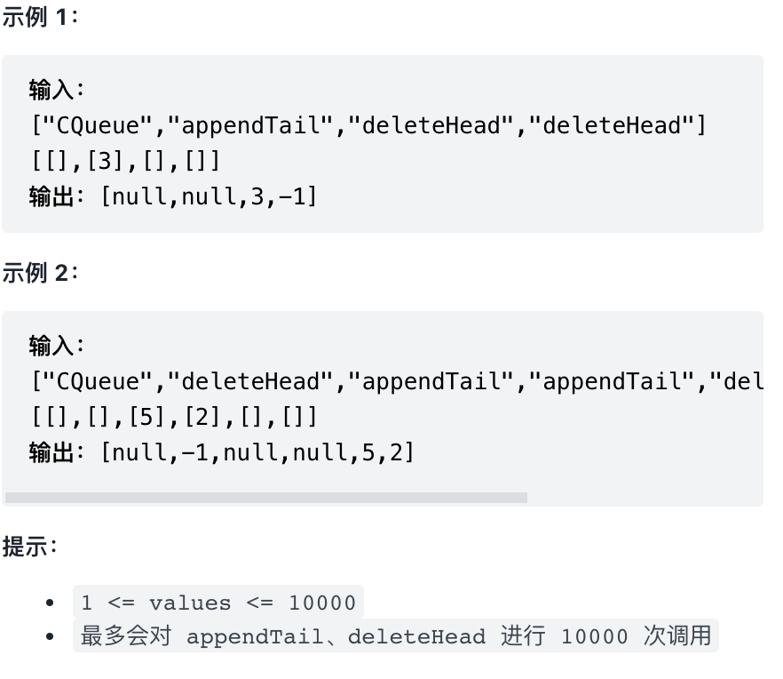

# [剑指 Offer 09. 用两个栈实现队列 (easy)](https://leetcode-cn.com/problems/yong-liang-ge-zhan-shi-xian-dui-lie-lcof/)
## 题目：


<br>
<br>

--------------------------------
## 理解：
["CQueue","appendTail","deleteHead","deleteHead"] 
这一行表示每一行代码的操作

[[],[3],[],[]]
这个表示每一行代码操作所需要的参数

1. 创建队列，返回值为null
2. 将3压入栈，返回值为null
3. 将栈底的元素删除，也就是消息队列中先进来的元素，所以是deleteHead，返回该元素的数值，所以为3
4. 继续删除栈底的元素，但是没有元素了，所以返回-1
<br>
<br>


--------------------------------
## Code


```python
class CQueue:

    def __init__(self):
        #双栈
        self.stack1=[]
        self.stack2=[]

    def appendTail(self, value: int) -> None:
        self.stack1.append(value)


    def deleteHead(self) -> int:
        if self.stack2==[]:
            if self.stack1==[]:
                return -1
            while self.stack1:
                self.stack2.append(self.stack1.pop())
        return self.stack2.pop()


# Your CQueue object will be instantiated and called as such:
# obj = CQueue()
# obj.appendTail(value)
# param_2 = obj.deleteHead()

```
- Time Complexity: 
- Space Complexity: 
<br>
<br>

```python


```
- Time Complexity: 
- Space Complexity: 
  
--------------------------------
## 扩展