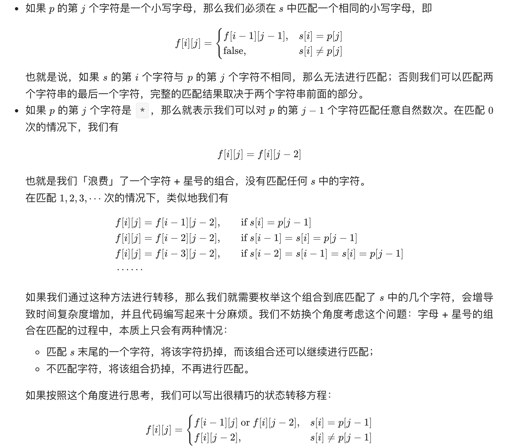
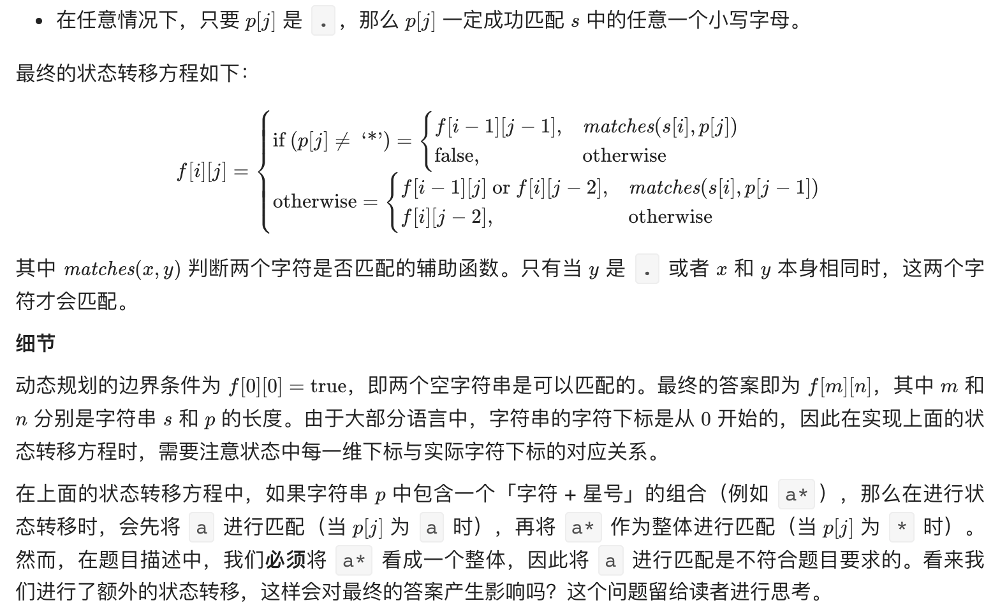

# [10. Regular Expression Matching(hard)](https://leetcode-cn.com/problems/regular-expression-matching/)
## 题目：
- Given an input string (s) and a pattern (p), implement regular expression matching with support for '.' and '*' where: 
    - `' . '` Matches any single character.​​​​
    - `' * '` Matches zero or more of the preceding element.
    - The matching should cover the entire input string (not partial).

* 示例:
  - Input: s = "aab", p = "c*a*b"
  - Output: true
  - Explanation: c can be repeated 0 times, a can be repeated 1 time. Therefore, it matches "aab".
<br>
<br>
  - Input: s = "ab", p = ".*"
  - Output: true
  - Explanation: ".*" means "zero or more (*) of any character (.)".

<br>
<br>

* Constraints:
  *  0 <= s.length <= 20    
  *  0 <= p.length <= 30
  *  s contains only lowercase English letters.
  *  p contains only lowercase English letters, '.', and '*'.
  *  It is guaranteed for each appearance of the character '*', there will be a previous valid character to match.

<br>
<br>

--------------------------------
## 理解：
- s里面只有小写字母，p有小写字母加上‘.' '*'
  - '  .' 匹配任意单个字符
  - ' * ' 匹配零个或多个前面的那一个元素
1. 递归解法：
   - 假设存在函数isMatch，判断s和p是否匹配
     - s和p匹配== s和p第一个制度匹配并且剩下的字符也匹配，判断剩下函数是否匹配需要调用isMatch
     - 随着规模减小，当p为null时，s也为空则返回true
<br>
<br>
2. 动态规划解法
    - 我们每次从字符串 p 中取出一个字符或者「字符 + 星号」的组合，并在 s 中进行匹配。对于 p 中一个字符而言，它只能在 s 中匹配一个字符，匹配的方法具有唯一性；而对于 p 中字符 + 星号的组合而言，它可以在 s 中匹配任意自然数个字符，并不具有唯一性。因此我们可以考虑使用动态规划，对匹配的方案进行枚举。
      - 我们用 f[i][j] 表示 s 的前 i 个字符与 p 中的前 j 个字符是否能够匹配。在进行状态转移时，我们考虑 p 的第j个字符的匹配情况：



   
--------------------------------
## Code

```python
class Solution:
    def isMatch(self, s: str, p: str) -> bool:
        if not p:
            return not s
        #match判断s是否为空并且p和s第一个char匹配或者p为‘.'
        match=((not(not s)) and (p[0]==s[0] or p[0]=='.'))
        #p长度大于2时才考虑‘*’
        if len(p)>=2 and p[1]=='*':
            #情况1:p直接跳过两个char。表示*前边的字符出现0次
            return (self.isMatch(s,p[2:]) or (match and self.isMatch(s[1:],p)))
        else:
            #情况2:p不变，例如s=aa，p=a*
            return match and self.isMatch(s[1:],p[1:])
```
- Time Complexity: 
- Space Complexity: 

<br>
<br>

```python
class Solution:
    def isMatch(self, s: str, p: str) -> bool:
        s_len = len(s)
        p_len = len(p)

        # dp[i][j] 表示 s[:i] 与 p[:j] 是否匹配，各自前 i、j 个是否匹配
        dp = [[False] * (p_len + 1) for _ in range(s_len + 1)]
        dp[0][0] = True

        # s 为空串
        for j in range(1, p_len + 1):
            # 若 p 的第 j 个字符 p[j - 1] 是 '*'
            # 说明第 j - 1、j 个可有可无
            # 那么如果前 j - 2 个已经匹配上，前 j 个也可以匹配上
            if p[j - 1] == '*':
                dp[0][j] = dp[0][j - 2]

        for i in range(1, s_len + 1):
            for j in range(1, p_len + 1):
                if p[j - 1] in {s[i - 1], '.'}:
                    dp[i][j] = dp[i - 1][j - 1]
                elif p[j - 1] == '*':
                    if p[j - 2] in {s[i - 1], '.'}:
                        dp[i][j] = dp[i][j - 2] or dp[i - 1][j - 2] or dp[i - 1][j]
                    else:
                        dp[i][j] = dp[i][j - 2]
        return dp[s_len][p_len]

```
- Time Complexity: O(mn)，其中 m 和 n 分别是字符串 s和p的长度。我们需要计算出所有的状态，并且每个状态在进行转移时的时间复杂度为 O(1）
- Space Complexity: O(mn)
--------------------------------
## 扩展