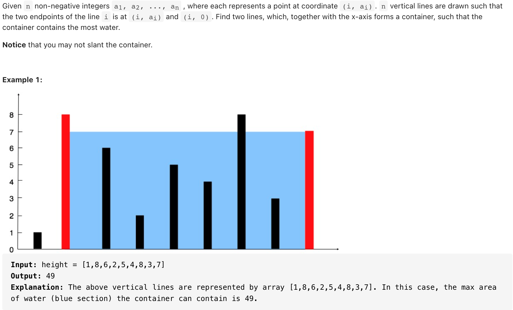

# [11.Container With Most Water (medium)](https://leetcode-cn.com/problems/container-with-most-water/)
## 题目：


* Constraints:
  * n == height.length
  * 2 <= n <= 105
  * 0 <= height[i] <= 104
<br>
<br>

--------------------------------
## 理解：
1. 暴力解法：尝试所有组合，以组合中最小值为基准--超时
<br>
<br>
2. 从两边向中间靠拢，这样只用遍历一遍，求得最大面积

--------------------------------
## Code
1. 暴力解法：
```python
class Solution:
    def maxArea(self, height: List[int]) -> int:
        a=[]
        for i in range(len(height)):
            for j in range(1,len(height)):
                temp=min(height[i],height[j])*(abs(i-j))
                a.append(temp)
        return max(a)
```
- Time Complexity: O(n^2)
- Space Complexity: O（1）

<br>
<br>

2.
```python
class Solution:
    def maxArea(self, height: List[int]) -> int:
        maxArea,i=0,0
        r=len(height)-1
        while i<r:
            maxArea=max(maxArea, min(height[i],height[r])*abs(r-i))
            if height[i]<height[r]:
                i+=1
            else:
                r-=1
        return maxArea
```
- Time Complexity: O(n)
- Space Complexity: O(1)

--------------------------------
## 扩展