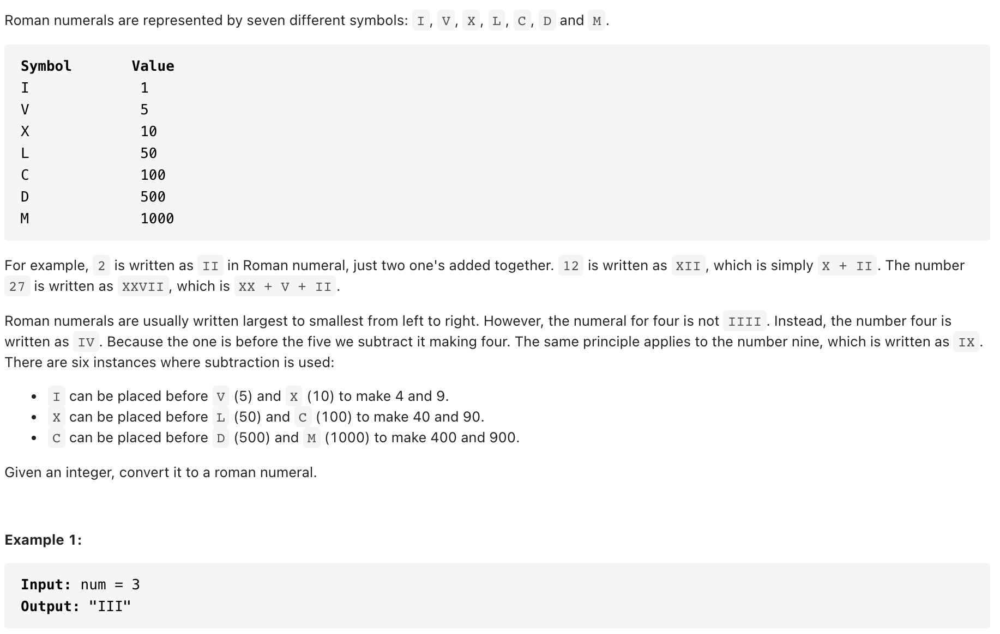

# [12. Integer to Roman (medium)](https://leetcode-cn.com/problems/integer-to-roman/)
## 题目：


* Constraints: 1<num<3999
<br>
<br>

--------------------------------
## 理解：

1. 神奇解法：主要就是把所有的组合列出来，因为罗马数字表示的大小就是把所有字母相加，所以每次 append 那个，再把对应的值减去就行了
<br>
<br>
基本都是暴力解法，比较喜欢这个
--------------------------------
## Code

```python
class Solution:
    def intToRoman(self, num: int) -> str:
        number=[1000,900,500,400,100,90,50,40,10,9,5,4,1]
        symbol=['M','CM','D','CD','C','XC','L','XL','X','IX','V','IV','I']

        res=[]

        for i in range(len(number)):
            while num>=number[i]:
                num=num-number[i]
                res+=symbol[i]
        return ''.join(res)
```
- Time Complexity: O（1）
- Space Complexity: O（1）

<br>
<br>

--------------------------------
## 扩展