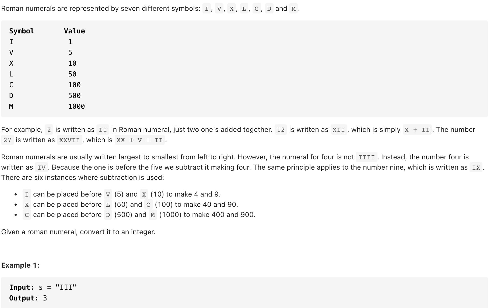
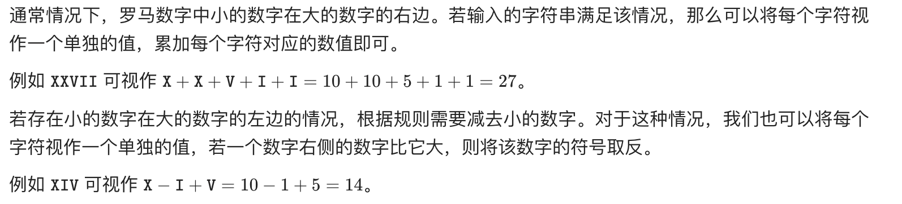

# [13. Roman to Integer (easy)](https://leetcode-cn.com/problems/roman-to-integer/)
## 题目：


<br>
<br>

* Constraints:
  * 1 <= s.length <= 15
  * s contains only the characters ('I', 'V', 'X', 'L', 'C', 'D', 'M').
  * It is guaranteed that s is a valid roman numeral in the range [1, 3999].

<br>
<br>

--------------------------------
## 理解：
用hashmap来对应值和str

<br>
<br>

--------------------------------
## Code

```python
class Solution:
    def romanToInt(self, s: str) -> int:
        sn={'I':1, 'V':5, 'X':10, 'L':50, 'C':100, 'D':500, 'M':1000}
        ans = 0
        n = len(s)
        for i, ch in enumerate(s):
            value = sn[ch]
            if i < n - 1 and value < sn[s[i + 1]]:
                ans -= value
            else:
                ans += value
        return ans
```
- Time Complexity: O(n)
- Space Complexity: O(1)

<br>
<br>

--------------------------------
## 扩展