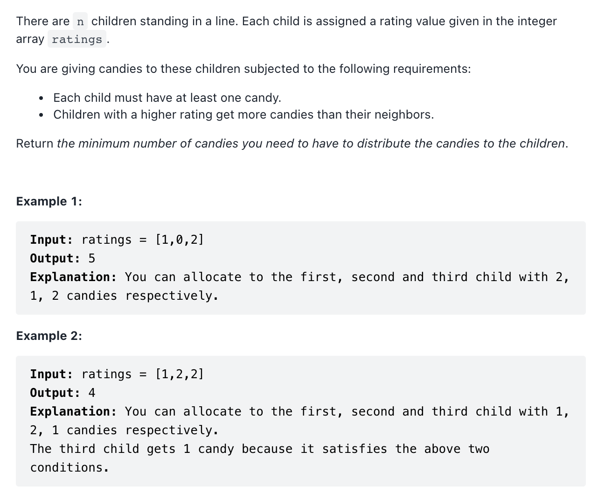

# [135. Candy (hard)](https://leetcode-cn.com/problems/candy/)
## 题目：


* Constraints:
<br>
<br>

--------------------------------
## 理解：
- 两次便利：
  - 规则：将「相邻的孩子中，评分高的孩子必须获得更多的糖果」这句话拆分为两个规则，分别处理。
    - 左规则：当 ratings[i−1]<ratings[i]时，i号学生的糖果数量将比i−1号孩子的糖果数量多
    - 右规则：当 ratings[i]>ratings[i+1] 时，i号学生的糖果数量将比i+1号孩子的糖果数量多
  - 先计算出左规则left 数组，在计算右规则的时候只需要用单个变量记录当前位置的右规则，同时计算答案即可。


<br>
<br>


--------------------------------
## Code


```python
class Solution:
    def candy(self, ratings: List[int])->int:
        l=len(ratings)
        left=[0]*l
        for i in range(l):
            if ratings[i]>rating[i-1] and i>0:
                left[i]=left[i-1]+1
            else:
                left[i]=1
        
        right=ans=0
        for i in range(l-1,-1,-1):
            if ratings[i]>ratings[i+1] and i<l-1:
                right+=1 
            else:
                right=1 
            ans+=max(left[i],right)
        return ans

```
- Time Complexity: 
- Space Complexity: 
<br>
<br>

```python
class Solution:
    def candy(self, ratings: List[int])->int:


```
- Time Complexity: 
- Space Complexity: 
  
--------------------------------
## 扩展