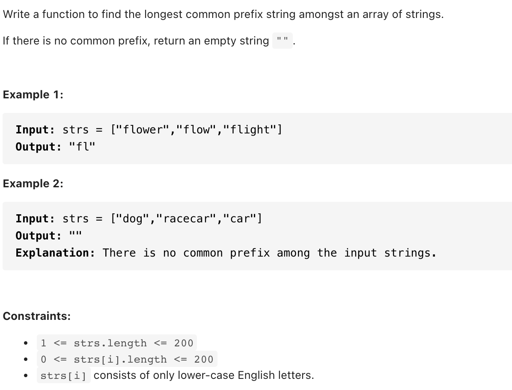
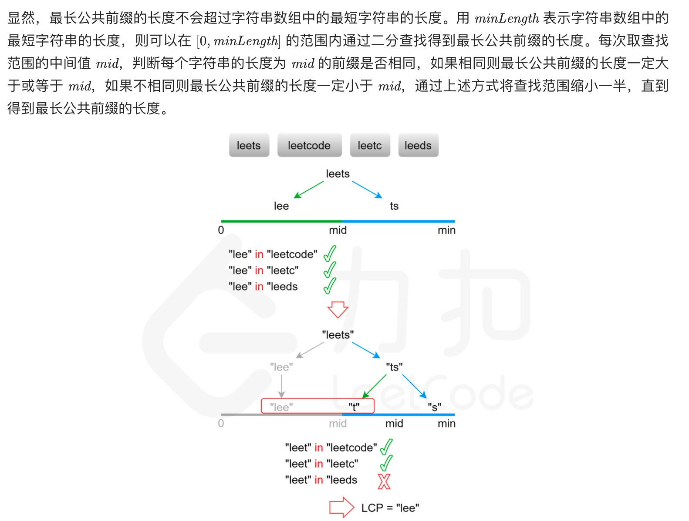

# [14. Longest Common Prefix (easy)](https://leetcode-cn.com/problems/longest-common-prefix)
## 题目：


* Constraints:
<br>
<br>

--------------------------------
## 理解：
1. 纵向扫描，
<br>
<br>
2. 二分查找
   

--------------------------------
## Code

```python
class Solution:
    def longestCommonPrefix(self, strs: List[str]) -> str:
        if len(strs)<=1:
            return strs[0]
        else:
            l=1
            temp=''
            while l<=len(strs[0]):
                temp=(strs[0])[:l]
                for i in strs[1:]:
                    if i.startswith(temp)!=True:
                        return temp[:l-1]
                l+=1
            return temp
```
- Time Complexity: O(mn)，其中 mm是字符串数组中的字符串的平均长度，n 是字符串的数量。最坏情况下，字符串数组中的每个字符串的每个字符都会被比较一次
- Space Complexity: O（1）

<br>
<br>
2. 二分法
   
```python
class Solution:
    def longestCommonPrefix(self, strs: List[str]) -> str:
        def isCommonPrefix(length):
            str0, count = strs[0][:length], len(strs)
            return all(strs[i][:length] == str0 for i in range(1, count))

        if not strs:
            return ""

        minLength = min(len(s) for s in strs)
        low, high = 0, minLength
        while low < high:
            mid = (high - low + 1) // 2 + low
            if isCommonPrefix(mid):
                low = mid
            else:
                high = mid - 1

        return strs[0][:low]
```
- Time Complexity: O(mnlogm), m是字符串的最小长度，n是字符串数量
- Space Complexity: O(1)

<br>
<br>
--------------------------------
## 扩展