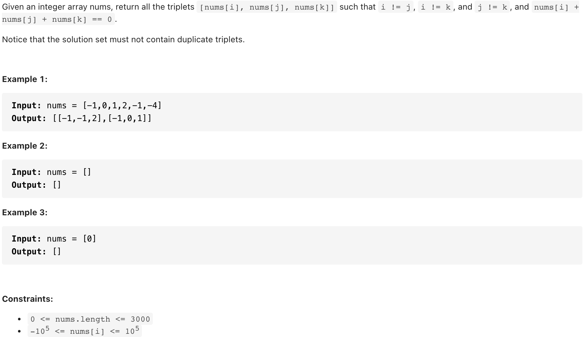

# [15. 3Sum (medium)](https://leetcode-cn.com/problems/3sum/)
## 题目：



<br>
<br>

--------------------------------
## 理解：
将nums分成零，正数，负数（字典存储，省得去重）
相加为0的三元组：三个零，一正一负一零，两正一负，两负一正
<br>
<br>


--------------------------------
## Code

```python
n=len(nums)
        res=[]
        if(not nums or n<3):
            return []
        nums.sort()
        res=[]
        for i in range(n):
            if(nums[i]>0):
                return res
            if(i>0 and nums[i]==nums[i-1]):
                continue
            L=i+1
            R=n-1
            while(L<R):
                if(nums[i]+nums[L]+nums[R]==0):
                    res.append([nums[i],nums[L],nums[R]])
                    while(L<R and nums[L]==nums[L+1]):
                        L=L+1
                    while(L<R and nums[R]==nums[R-1]):
                        R=R-1
                    L=L+1
                    R=R-1
                elif(nums[i]+nums[L]+nums[R]>0):
                    R=R-1
                else:
                    L=L+1
        return res


```
- Time Complexity: 
- Space Complexity: 

<br>
<br>

--------------------------------
## 扩展