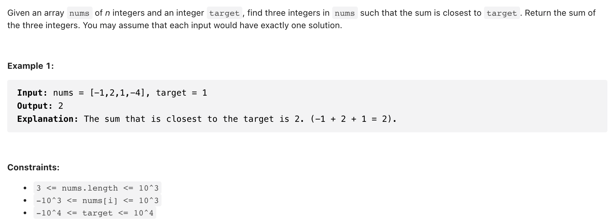

# [16. 3Sum Closest (medium)](https://leetcode-cn.com/problems/3sum-closest/)
## 题目：



<br>
<br>

--------------------------------
## 理解：
我们完全可以先将数组排序，然后先固定一个数字，然后利用头尾两个指针进行遍历，降低一个 O（n）的时间复杂度。

如果 sum 大于 target 就减小右指针，反之，就增加左指针。
<br>
<br>

--------------------------------
## Code

```python
class Solution:
    def threeSumClosest(self, nums: List[int], target: int) -> int:
        if not nums or len(nums)<3:
            return None
        n=len(nums)
        value=10000000000
    
        nums.sort()
        for i in range(n):
            left=i+1
            right=n-1
            while left<right:

                if abs(nums[i]+nums[left]+nums[right]-target)<value:
                    s=nums[i]+nums[left]+nums[right]
                    value=abs(s-target)

                if nums[i]+nums[left]+nums[right]>target:
                    right-=1
                else:
                    left+=1
        return s


```
- Time Complexity: 如果是快速排序的 O(log_n)再加上 O（n²），所以就是 O（n²）
- Space Complexity: O(1)

<br>
<br>

--------------------------------
## 扩展