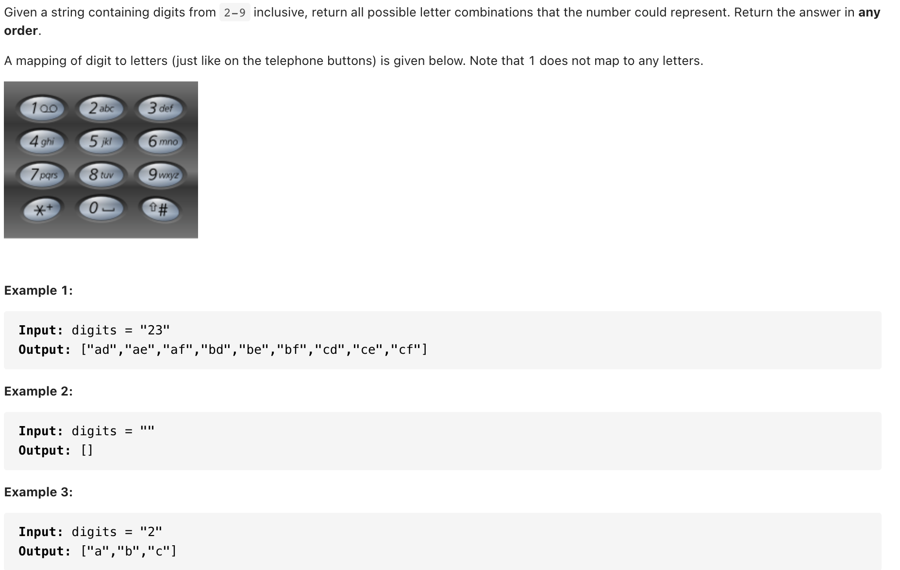

# [17. Letter Combinations of a Phone Number(medium)](https://leetcode-cn.com/problems/letter-combinations-of-a-phone-number/)
## 题目：



* Constraints:
  * 0 <= digits.length <= 4
  * digits[i] is a digit in the range ['2', '9'].

<br>
<br>

--------------------------------
## 理解：

<br>
<br>

--------------------------------
## Code

```python
class Solution:
    def letterCombinations(self, digits: str) -> List[str]:
        if not digits:
            return []
        res=['']

        d={'2': ['a', 'b', 'c'],
               '3': ['d', 'e', 'f'],
               '4': ['g', 'h', 'i'],
               '5': ['j', 'k', 'l'],
               '6': ['m', 'n', 'o'],
               '7': ['p', 'q', 'r', 's'],
               '8': ['t', 'u', 'v'],
               '9': ['w', 'x', 'y', 'z']}
        

        
        for i in digits:
            res=[j+k for j in res for k in d[i]]
        return res
```
- Time Complexity: 
- Space Complexity: 

<br>
<br>

--------------------------------
## 扩展