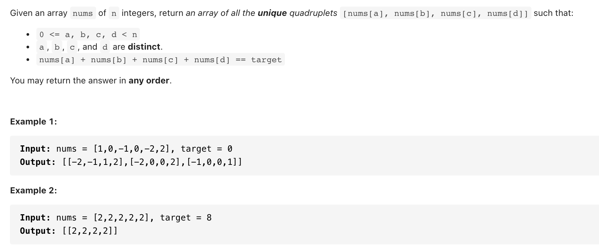

# [18. 4Sum (medium)](https://leetcode-cn.com/problems/4sum/)
## 题目：



* Constraints:
  * 1 <= nums.length <= 200
  * -109 <= nums[i] <= 109
  * -109 <= target <= 109
<br>
<br>

--------------------------------
## 理解：
比3sum多一个循环
<br>
<br>

--------------------------------
## Code

```python
class Solution:
    def fourSum(self, nums: List[int], target: int) -> List[List[int]]:
        n=len(nums)
        if not nums or n<4:
            return []
        res=[]
        nums.sort()
        for i in range(n-3):
            if (i==0) or (i>0 and nums[i]!=nums[i-1]):
                for j in range(i+1,n-2):
                    if (j==i+1) or (nums[j]!=nums[j-1]):
                        l=j+1 
                        r=n-1
                        while l<r:
                            t=nums[i]+nums[l]+nums[j]+nums[r]
                            if t==target:
                                s=[nums[i],nums[l],nums[j],nums[r]]
                                res.append(s)                    
                                while l<r and nums[l]==nums[l+1]:
                                    l+=1
                                while l<r and nums[r]==nums[r-1]:
                                    r-=1
                                l+=1
                                r-=1
                            elif t<target:
                                l+=1
                            else:
                                r-=1
        return res

```
- Time Complexity: O(N^3)
- Space Complexity: O(N) N 是指 n 个元素的排列组合个数，即 N=C^4_n，用来保存结果。


<br>
<br>

--------------------------------
## 扩展