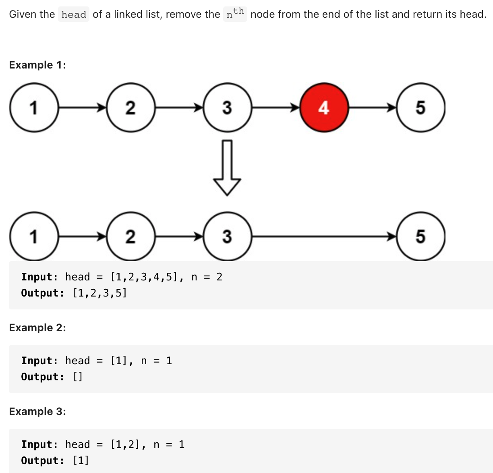

# [19. Remove Nth Node From End of List (medium)](https://leetcode-cn.com/problems/remove-nth-node-from-end-of-list/)
## 题目：



* Constraints: 
  * The number of nodes in the list is sz.
  * 1 <= sz <= 30
  * 0 <= Node.val <= 100
  * 1 <= n <= sz


<br>
<br>

--------------------------------
## 理解：
在对链表进行操作时，一种常用的技巧是添加一个哑节点（dummy node），它的 next 指针指向链表的头节点。这样一来，我们就不需要对头节点进行特殊的判断了。

1. `暴力解法`：删除倒数第n个节点
   1. 找到列表长度
   2. 删除正数第L-n+1个节点
      1. 时间复杂度：O(n)
      2. 空间复杂度：O(1)

2. `快慢指针法`：涉及链表特殊位置考虑快慢指针，删除链表节点需找到它的前驱
      1. 时间复杂度：O(n)
      2. 空间复杂度：O(1)

--------------------------------
## Code
1. 暴力解法
   
```python
class Solution:
    def removeNthFromEnd(self, head: ListNode, n: int) -> ListNode:
        def getLength(head: ListNode) -> int:
            length = 0
            while head:
                length += 1
                head = head.next
            return length
        
        dummy = ListNode(0, head)
        length = getLength(head)
        cur = dummy
        for i in range(1, length - n + 1):
            cur = cur.next
        cur.next = cur.next.next
        return dummy.next

```
- Time Complexity: O(l) l是列表长度
- Space Complexity: O(1)

<br>
<br>
2. 快慢指针
   
```python
class Solution:
    def removeNthFromEnd(self, head: ListNode, n: int) -> ListNode:
        dummy = ListNode(0, head)
        first = head
        second = dummy
        for i in range(n):
            first = first.next

        while first:
            first = first.next
            second = second.next
        
        second.next = second.next.next
        return dummy.next

```
- Time Complexity: O(l) l是列表长度
- Space Complexity: O(1)
--------------------------------
## 扩展