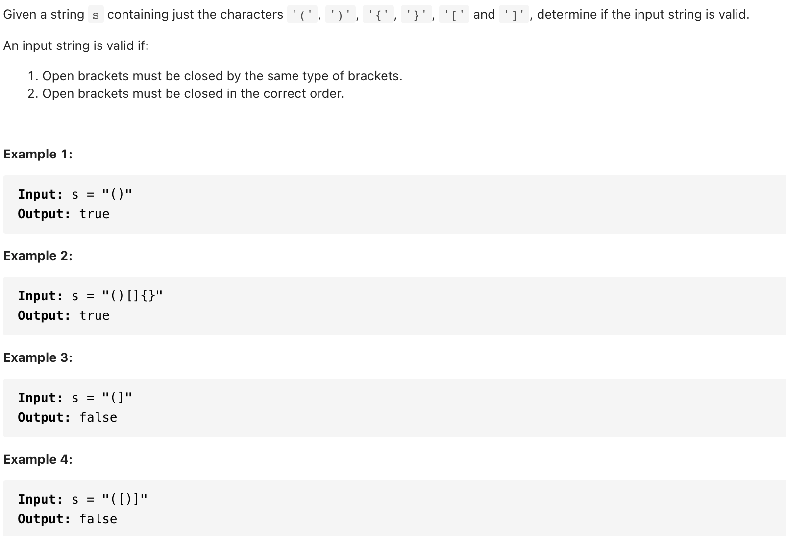

# [20. Valid Parentheses (easy)](https://leetcode-cn.com/problems/valid-parentheses/)
## 题目：


* Constraints:
<br>
<br>

--------------------------------
## 理解：
1. 栈
   1. 判断括号的有效性可以使用「栈」这一数据结构来解决。
      1. 我们遍历给定的字符串 s。当我们遇到一个左括号时，我们会期望在后续的遍历中，有一个相同类型的右括号将其闭合。由于后遇到的左括号要先闭合，因此我们可以将这个左括号放入栈顶。
      2. 当我们遇到一个右括号时，我们需要将一个相同类型的左括号闭合。此时，我们可以取出栈顶的左括号并判断它们是否是相同类型的括号。如果不是相同的类型，或者栈中并没有左括号，那么字符串 s 无效，返回 False。为了快速判断括号的类型，我们可以使用哈希表存储每一种括号。哈希表的键为右括号，值为相同类型的左括号。
      3. 在遍历结束后，如果栈中没有左括号，说明我们将字符串 ss 中的所有左括号闭合，返回 True，否则返回False。
      4. 注意到有效字符串的长度一定为偶数，因此如果字符串的长度为奇数，我们可以直接返回 }False，省去后续的遍历判断过程。


<br>
<br>
2. 作弊解法（喜欢）replace

--------------------------------
## Code
1. 栈
   
```python
class Solution:
    def isValid(self, s: str) -> bool:
        if len(s) % 2 == 1:
            return False
        
        pairs = {
            ")": "(",
            "]": "[",
            "}": "{",
        }
        stack = list()
        for ch in s:
            if ch in pairs:
                if not stack or stack[-1] != pairs[ch]:
                    return False
                stack.pop()
            else:
                stack.append(ch)
        
        return not stack

```
- Time Complexity: O(n)
- Space Complexity: O(n+∣Σ∣)，其中Σ 表示字符集，本题中字符串只包含 6 种括号，∣Σ∣=6。栈中的字符数量为O(n)，而哈希表使用的空间为O(∣Σ∣)，相加即可得到总空间复杂度。


<br>
<br>
1. 作弊解法
   
```python
class Solution:
    def isValid(self, s: str) -> bool:
        while '{}' in s or '[]' in s or '()' in s:
            s=s.replace('{}', '')
            s=s.replace('[]', '')
            s=s.replace('()', '')
        return s==''


```
- Time Complexity: O(n)
- Space Complexity: O（1）

--------------------------------
## 扩展