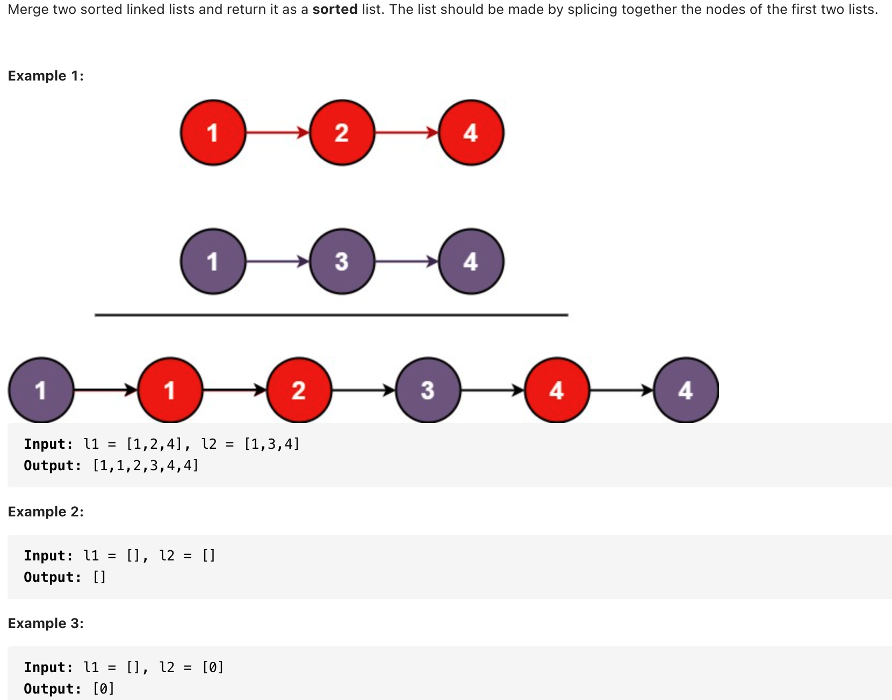
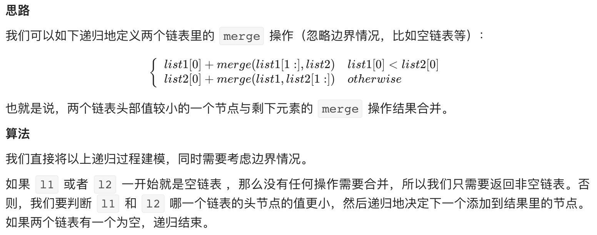
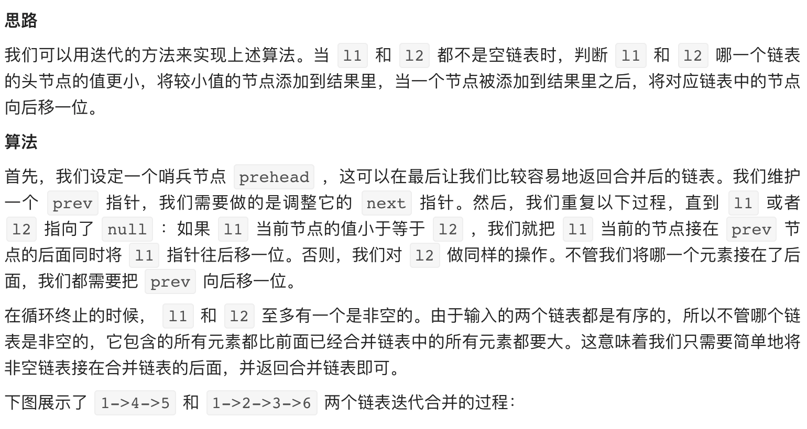

# [21. Merge Two Sorted Lists (easy)](https://leetcode-cn.com/problems/merge-two-sorted-lists/)
## 题目：


* Constraints:
<br>
<br>

--------------------------------
## 理解：
1. 递归

2. 迭代

<br>
<br>

--------------------------------
## Code
1. 递归：
   
```python
# Definition for singly-linked list.
# class ListNode:
#     def __init__(self, val=0, next=None):
#         self.val = val
#         self.next = next
class Solution:
    def mergeTwoLists(self, l1: ListNode, l2: ListNode) -> ListNode:
        if not l1:
            return l2
        elif not l2:
            return l1
        elif l1.val<l2.val:
            l1.next= self.mergeTwoLists(l1.next,l2)
            return l1
        else:
            l2.next= self.mergeTwoLists(l1, l2.next)
            return l2
```
- Time Complexity: O(m+n)
- Space Complexity: O(m+n)

<br>
<br>

2. 迭代
   
```python
class Solution:
    def mergeTwoLists(self, l1, l2):
        prehead = ListNode(-1)

        prev = prehead
        while l1 and l2:
            if l1.val <= l2.val:
                prev.next = l1
                l1 = l1.next
            else:
                prev.next = l2
                l2 = l2.next            
            prev = prev.next

        # 合并后 l1 和 l2 最多只有一个还未被合并完，我们直接将链表末尾指向未合并完的链表即可
        prev.next = l1 if l1 is not None else l2

        return prehead.next
```
- Time Complexity: O(m+n)
- Space Complexity: O（1）
--------------------------------
## 扩展