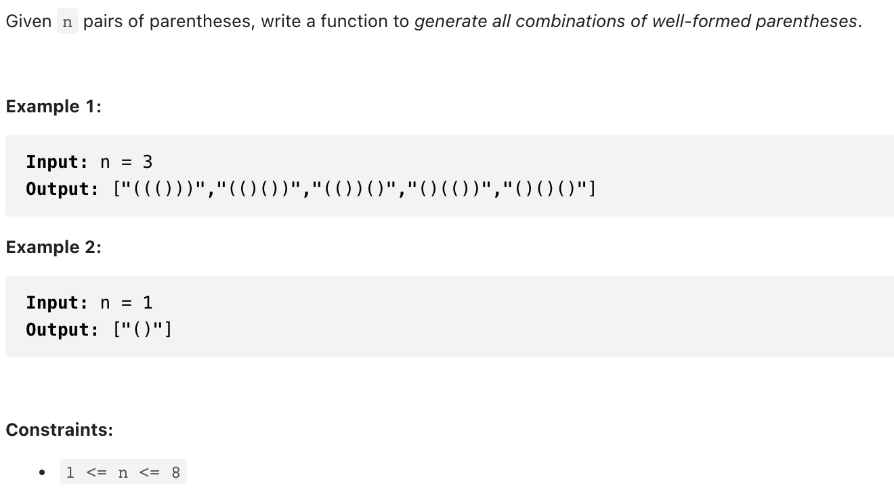

# [22. Generate Parentheses (medium)](https://leetcode-cn.com/problems/generate-parentheses/)
## 题目：



<br>
<br>

--------------------------------
## 理解：

<br>
<br>

--------------------------------
## Code

```python
class Solution:
    def generateParenthesis(self, n: int) -> List[str]:
        res=[]
        def dfs(p, num, left, right):
            if len(p)== n*2:# 长度为n*2时停止迭代
                res.append(p)
                return 
            if left<num: # 左括号数量不多于n
                dfs(p+'(',num, left+1, right)
            if right<left:
                dfs(p+')',num, left,right+1)
        
        dfs('',n,0,0)

        return res
```
- Time Complexity: 
- Space Complexity: 

<br>
<br>

--------------------------------
## 扩展

[卡塔兰数](https://leetcode.wang/leetCode-22-Generate-Parentheses.html)