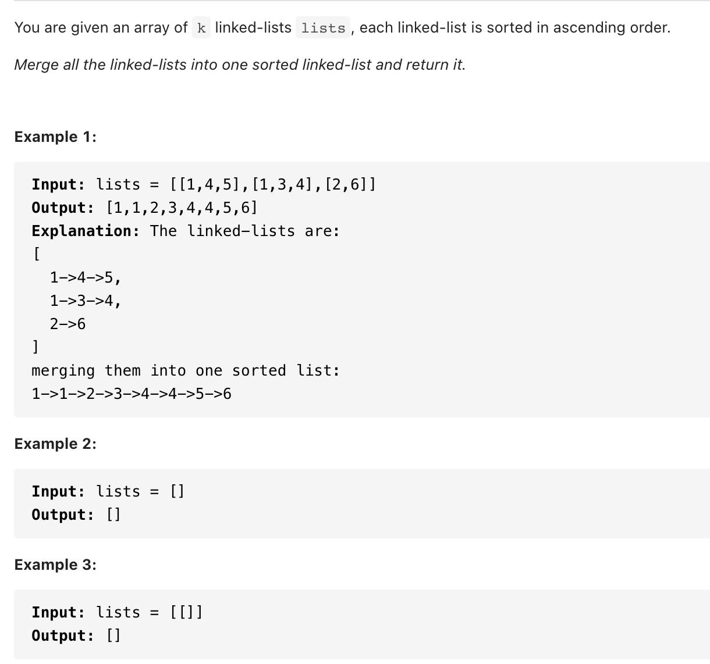

# [23. Merge k Sorted Lists(hard)](https://leetcode-cn.com/problems/merge-k-sorted-lists/)
## 题目：


* Constraints:
<br>
<br>

--------------------------------
## 理解：
思路1:

优先级队列

时间复杂度:$O(n*log(k))$,n是所有链表中元素的总和,k是链表个数.


<br>
<br>
思路2:

分而治之

链表两两合并
--------------------------------
## Code

```python
# Definition for singly-linked list.
# class ListNode:
#     def __init__(self, x):
#         self.val = x
#         self.next = None

class Solution:
    def mergeKLists(self, lists: List[ListNode]) -> ListNode:
        import heapq
        dummy = ListNode(0)
        p = dummy
        head = []
        for i in range(len(lists)):
            if lists[i] :
                heapq.heappush(head, (lists[i].val, i))
                lists[i] = lists[i].next
        while head:
            val, idx = heapq.heappop(head)
            p.next = ListNode(val)
            p = p.next
            if lists[idx]:
                heapq.heappush(head, (lists[idx].val, idx))
                lists[idx] = lists[idx].next
        return dummy.next
```
- Time Complexity: 
- Space Complexity: 

<br>
<br>
2. 猴子补丁
   
```python
class Solution:
    def mergeKLists(self, lists: List[ListNode]) -> ListNode:

        def __lt__(self, other):
            return self.val < other.val
        ListNode.__lt__ = __lt__
        
        import heapq
        heap = []
        dummy = ListNode(-1)
        p = dummy

        for l in lists:
            if l:
                heapq.heappush(heap, l)
        while heap:
            node = heapq.heappop(heap)
            p.next = ListNode(node.val)
            p = p.next
            if node.next:
                heapq.heappush(heap, node.next)
        
        return dummy.next

```
- Time Complexity: 
- Space Complexity: 

<br>
<br>
3. 分而治之
   
```python
class Solution:
    def mergeKLists(self, lists: List[ListNode]) -> ListNode:

        n = len(lists)

        def merge(left, right):
            if left > right:
                return
            if left == right:
                return lists[left]
            mid = (left + right) // 2
            l1 = merge(left, mid)
            l2 = merge(mid + 1, right)
            return mergeTwoLists(l1, l2)

        def mergeTwoLists(l1, l2):
            if not l1 or not l2:
                return l1 or l2
            if l1.val < l2.val:
                l1.next = mergeTwoLists(l1.next, l2)
                return l1
            else:
                l2.next = mergeTwoLists(l1, l2.next)
                return l2

        return merge(0, n - 1)
```
- Time Complexity: 
- Space Complexity: 

--------------------------------
## 扩展
[猴子补丁（monkey patch)](https://www.pynote.net/archives/3547)