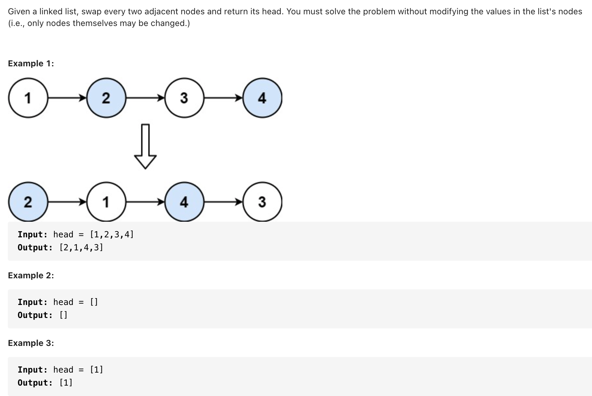
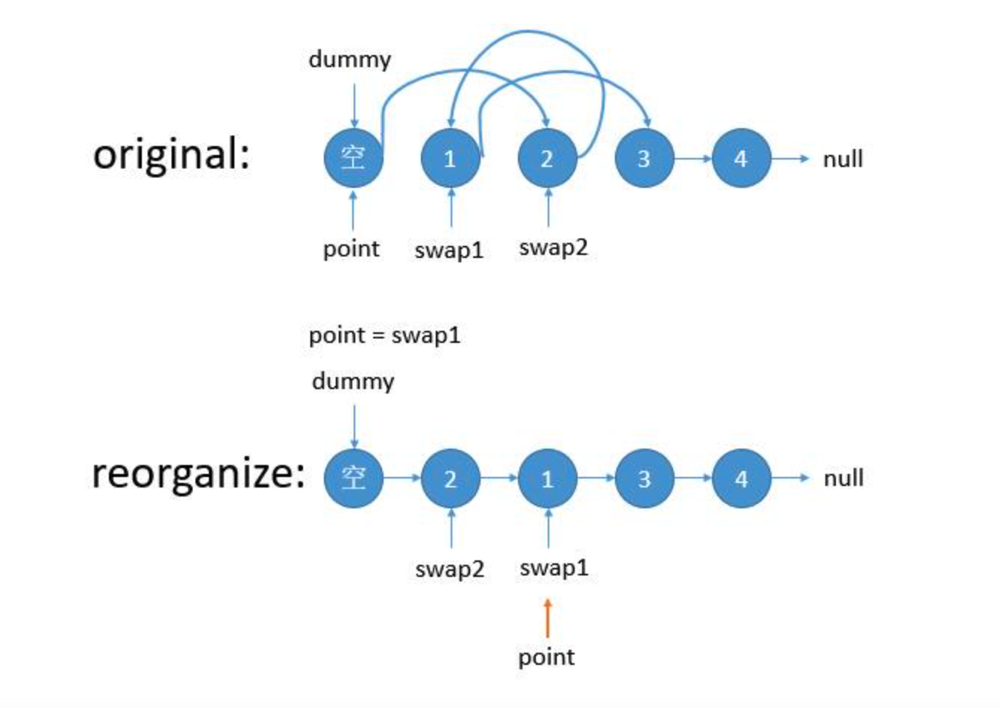
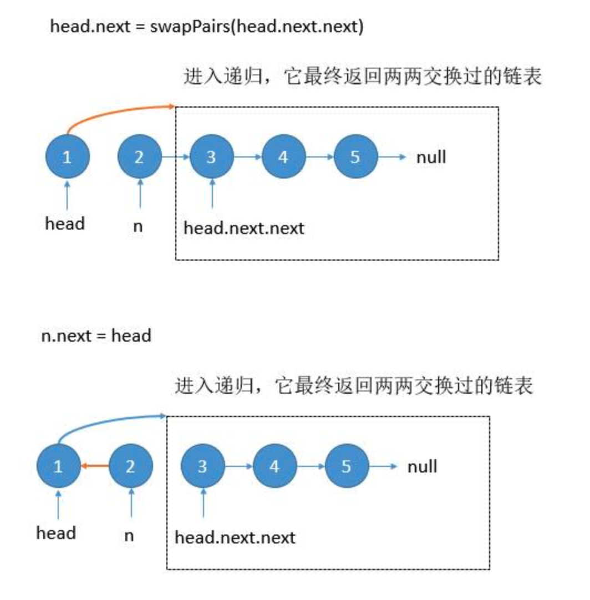

# [24. Swap Nodes in Pairs (medium)](https://leetcode-cn.com/problems/swap-nodes-in-pairs/)
## 题目：


* Constraints:
<br>
<br>

--------------------------------
## 理解：
1. 迭代：为了避免单独讨论头结点的情况，一般先申请一个空结点指向头结点，然后再用一个指针来遍历整个链表。
   - p 是两个要交换结点前边的一个位置。


<br>
<br>
2. 递归：
   
   - 找终止条件：本题终止条件很明显，当递归到链表为空或者链表只剩一个元素的时候，没得交换了，自然就终止了。
   - 找返回值：返回给上一层递归的值应该是已经交换完成后的子链表。
   - 单次的过程：因为递归是重复做一样的事情，所以从宏观上考虑，只用考虑某一步是怎么完成的。我们假设待交换的俩节点分别为head和next，next的应该接受上一级返回的子链表(参考第2步)。就相当于是一个含三个节点的链表交换前两个节点，就很简单了，想不明白的画画图就ok
  


--------------------------------
## Code

```python
# Definition for singly-linked list.
# class ListNode:
#     def __init__(self, val=0, next=None):
#         self.val = val
#         self.next = next
class Solution:
    def swapPairs(self, head: ListNode) -> ListNode:
        dummy=ListNode(0)
        dummy.next=head
        p=dummy

        while p.next and p.next.next:
            s1=p.next
            s2=p.next.next

            p.next=s2
            s1.next=s2.next
            s2.next=s1
            p=s1

        return dummy.next 
```
- Time Complexity: O(N)
- Space Complexity: O(1)

<br>
<br>

```python
class Solution:
    def swapPairs(self, head: ListNode) -> ListNode:
        if not head or not head.next:
            return head
        
        n=head.next
        head.next=self.swapPairs(head.next.next)
        n.next=head
        return n

```
- Time Complexity: 
- Space Complexity: 
  
--------------------------------
## 扩展