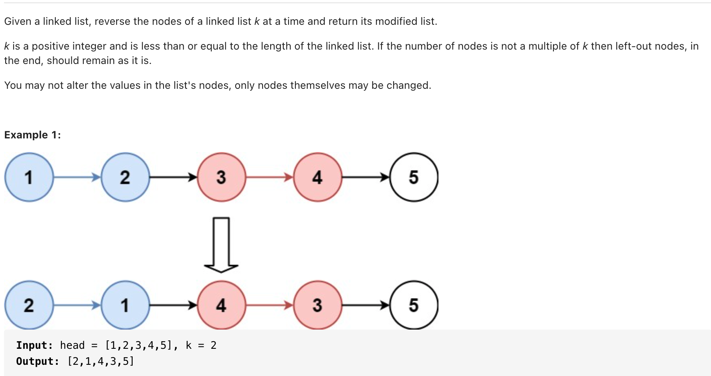

# [25. Reverse Nodes in k-Group  (hard)](https://leetcode-cn.com/problems/reverse-nodes-in-k-group/)
## 题目：


* Constraints:
<br>
<br>

--------------------------------
## 理解：
1. 栈
2. 尾插法

<br>
<br>


--------------------------------
## Code
1. 栈
   
```python
# Definition for singly-linked list.
# class ListNode:
#     def __init__(self, val=0, next=None):
#         self.val = val
#         self.next = next
class Solution:
    def reverseKGroup(self, head: ListNode, k: int) -> ListNode:
        n=ListNode(0)
        p=n

        while True:
            count=k
            s=[]
            temp=head
            while count and temp:
                s.append(temp)
                temp=temp.next
                count-=1
            if count:
                p.next=head
                break
            while s:
                p.next=s.pop()
                p=p.next
            p.next=temp
            head=temp
        return n.next
```
- Time Complexity: 
- Space Complexity: 

<br>
<br>

2. 尾插法
   
```python
class Solution:
    def reverseKGroup(self, head: ListNode, k: int) -> ListNode:
        dummy=ListNode(0)
        dummy.next=head

        pre=dummy
        tail=dummy
        while True:
            count=k
            while count and tail:
                count-=1
                tail=tail.next
            if not tail:
                break
            head=pre.next
            while pre.next !=tail:
                cur=pre.next
                pre.next=cur.next
                cur.next=tail.next
                tail.next=cur
            pre=head
            tail=head
        return dummy.next
```
- Time Complexity: 
- Space Complexity: 

<br>
<br>

```python
class Solution:
    def reverseKGroup(self, head: ListNode, k: int) -> ListNode:
        cur=head
        count=0
        while cur and count!=k:
            cur=cur.next
            count+=1
        if count==k:
            cur=self.reverseKGroup(cur, k)
            while count:
                temp=head.next
                head.next=cur
                cur=head
                head=temp
                count-=1
            head=cur 
        return head

```
- Time Complexity: 
- Space Complexity: 
  
--------------------------------
## 扩展