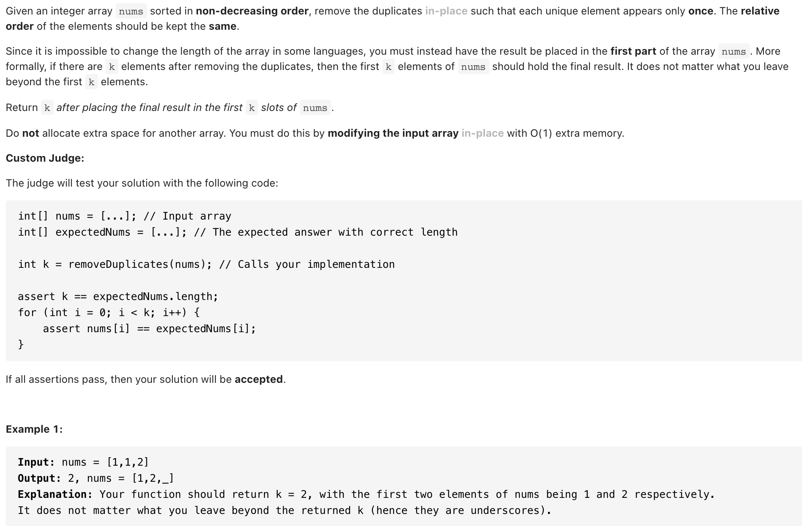

# [ 26. Remove Duplicates from Sorted Array(easy )](https://leetcode-cn.com/problems/remove-duplicates-from-sorted-array/)
## 题目：




* Constraints:
<br>
<br>

--------------------------------
## 理解：

1. 双指针解法：
   - 利用快慢指针，i 指针从 0 开始，j 指针从 1 开始，如果 i 和 j 所指数字相等，就一直后移 j 。如果不相等，i 指针后移一位用来保存当前 j 所指的值，然后继续回到 j 的后移中去。
<br>
<br>


--------------------------------
## Code

```python
class Solution:
    def removeDuplicates(self, nums: List[int]) -> int:
        if not nums or len(nums)==1:
            return len(nums)
        
        i=0
        j=1
        while j<len(nums):
            if nums[i]==nums[j]:
                j+=1
            else:
                i+=1
                nums[i]=nums[j]
                j+=1
        return i+1
```
- Time Complexity: O(N)
- Space Complexity: O(1)

<br>
<br>

```python


```
- Time Complexity: O(N)
- Space Complexity: O(1)
  
--------------------------------
## 扩展