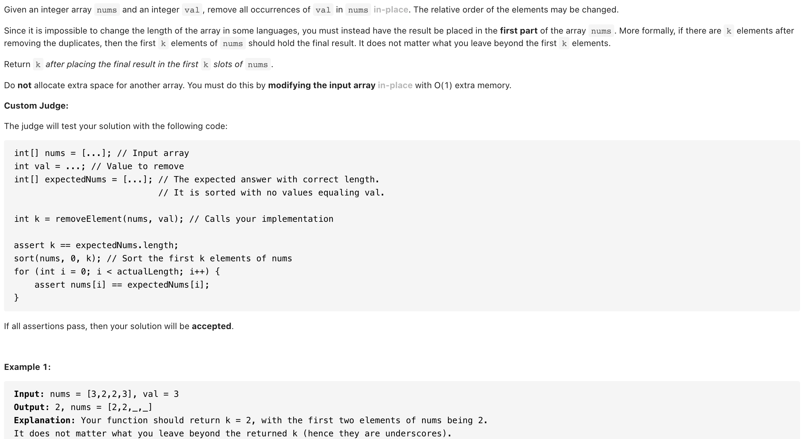

# [27. Remove Element (easy)](https://leetcode-cn.com/problems/remove-element/)
## 题目：


* Constraints:
<br>
<br>

--------------------------------
## 理解：

参考26
<br>
<br>


--------------------------------
## Code

```python
class Solution:
    def removeElement(self, nums: List[int], val: int) -> int:
        if not nums:
            return 0
        
        j=0

        for i in range(len(nums)):
            if nums[i]!=val:
                nums[j]=nums[i]
                j+=1
        return j
```
- Time Complexity: 
- Space Complexity: 

<br>
<br>

```python


```
- Time Complexity: 
- Space Complexity: 
  
--------------------------------
## 扩展