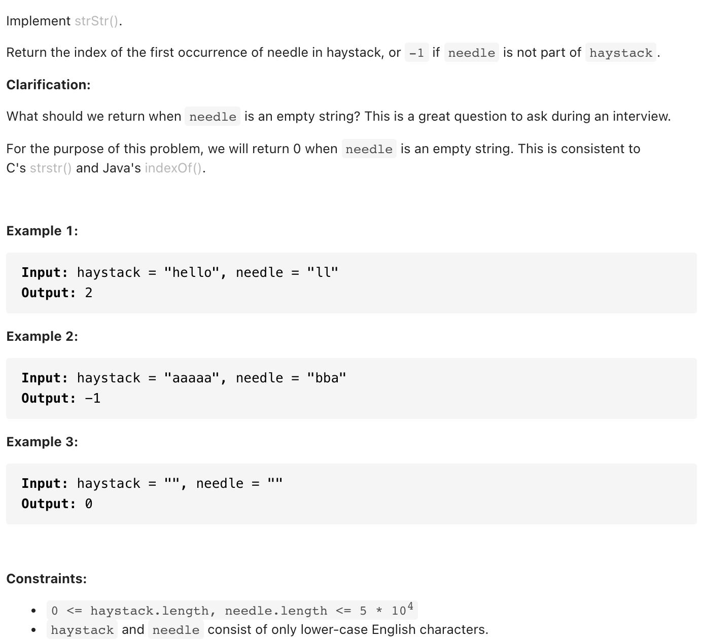

# [28. Implement strStr() (easy)](https://leetcode-cn.com/problems/implement-strstr/)
## 题目：


* Constraints:
<br>
<br>

--------------------------------
## 理解：

1. python find
<br>
<br>
2. 双指针，把haystack切割成needle
--------------------------------
## Code

```python
return haystack.find(needle)
```
- Time Complexity: 
- Space Complexity: 

<br>
<br>

```python
class Solution:
    def strStr(self, haystack: str, needle: str) -> int:
        if not needle or needle=='':
            return 0
        
  
        n,h=len(needle),len(haystack)
        for i in range(h):
            if haystack[i:n+i]==needle:
                return i
        
        return -1


```
- Time Complexity: 
- Space Complexity: 
  
--------------------------------
## 扩展