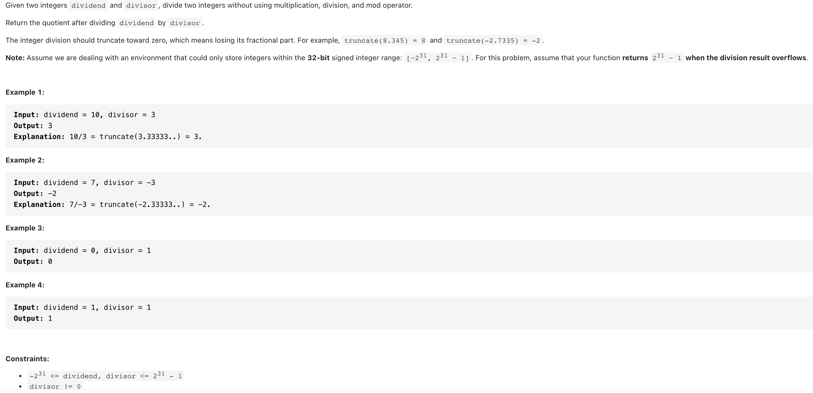

# [29. Divide Two Integers (medium)](https://leetcode-cn.com/problems/divide-two-integers/)
## 题目：


* Constraints:
<br>
<br>

--------------------------------
## 理解：
 使用递归和二进制移位

<br>
<br>


--------------------------------
## Code

```python
class Solution:
    def divide(self, dividend: int, divisor: int) -> int:
        i, a, b = 0, abs(dividend), abs(divisor)
        if a == 0 or a < b:
            return 0
        
        while b <= a:
            b = b << 1
            i = i + 1
        else:
            res = (1 << (i - 1)) + self.divide(a - (b >> 1), abs(divisor))
            if (dividend ^ divisor) < 0:
                res = -res
            return min(res, (1 << 31) - 1)
                    
```
- Time Complexity: 
- Space Complexity: 

<br>
<br>

```python


```
- Time Complexity: 
- Space Complexity: 
  
--------------------------------
## 扩展