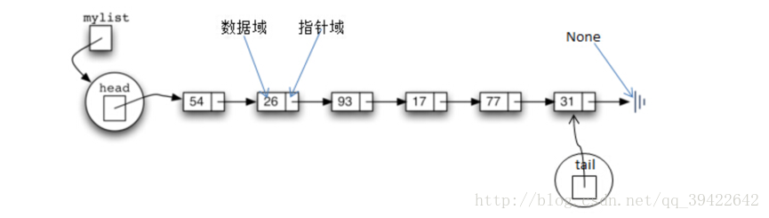

# [2. Add Two Numbers(Medium)](https://leetcode-cn.com/problems/add-two-numbers)
## 题目:
You are given two **non-empty** linked lists representing two non-negative integers. The digits are stored in **reverse order**, and each of their nodes contains a single digit. Add the two numbers and return the sum as a linked list.

* You may assume the two numbers do not contain any leading zero, except the number 0 itself.


**示例:**

**Input**: l1 = [2,4,3], l2 = [5,6,4]

**Output**: [7,0,8]

Explanation: 342 + 465 = 807.
<br>
<br>

## 理解：
需要考虑进位问题，用carry表示（初始为0，最大为1-9+9+1）
* 初始化一个ListNode(0),将curr指向节点的头
* 一些条件判断
* 循环：条件是l1 or l1 or carry!=0
    * 用x,y判断l1,l2的头val,空则为0
    * temp sum=x+y+carry(上一个temp的进位)
    * 为下一个temp计算carry，temp/10（取整）
    * 创建一个值为 temp mod 10 的node（temp%10)取出个位数上的值，将curr的next指向这个node，并将curr指向变为新的节点
        * 题外话：<br>
            * **mod** <br>
            The modulo (or "modulus" or "mod") is the remainder after dividing one number by another.
                * *Example*: 100 mod 9 equals 1. Because 100/9 = 11 with a remainder of 1.<br> *Another example*: 14 mod 12 equals 2. Because 14/12 = 1 with a remainder of 2.
    * 判断l1,l2，将其指向next
    * 判断carry是否为1，如果为1，ListNode(1):在链表末尾增加一个为1的节点
    * 返回dummy head的next（个位数开始的地方）
        * 不用单独对head进行判断和改变val，如果一开始的head就代表个位数，那么开始初始化的时候并不知道它的值是多少，所以还需要再进入循环前单独对它的进行值的更正（现在只需要一个循环）
<br>
<br>

--------------------------------
## Code
```python3
# Definition for singly-linked list.
# class ListNode:
#     def __init__(self, val=0, next=None):
#         self.val = val
#         self.next = next
class Solution:
    def addTwoNumbers(self, l1: ListNode, l2: ListNode) -> ListNode:
        result= ListNode(0)
        curr=result
        if not l1 and l2:
            return [0]
        if not l1:
            return l2
        if not l2:
            return l1
        else:
            temp=0
            carry=0
            while l1 or l2 or carry:
                x=l1.val if l1 else 0
                y=l2.val if l2 else 0
                temp=x+y+carry
                carry=temp//10
                curr.next=ListNode(temp%10)
                curr=curr.next
           
                if l1:
                    l1=l1.next
                if l2:
                    l2=l2.next
            if(carry>0):
                curr.next=ListNode(1)
            return result.next
```
* Time complexity: O(max(len(l1),len(l2)))

<br>
================================================================
## 扩展：
### [ListNode](https://stackoverflow.com/questions/56515975/python-logic-of-listnode-in-leetcode)

+ 链表是通过一个个节点组成的，每个节点都包含了称为cargo的基本单元，它也是一种递归的数据结构。它能保持数据之间的逻辑顺序，但存储空间不必按照顺序存储。<br>


    - 链表的基本元素有：
        - **node**：每个节点有两个部分，左边部分称为值域，用来存放用户数据；右边部分称为指针域，用来存放指向下一个元素的指针。
        - **head**:head节点永远指向第一个节点
        - **tail**: tail永远指向最后一个节点
        - **None**:链表中最后一个节点的指针域为None值

result = ListNode(0)<br>
#r<br>
#0 -> None<br>

result_tail = result<br>
#r<br>
#0 -> None<br>
\#rt<br>

result_tail.next = ListNode(1)<br>
#r<br>
#0 -> 1 -> None<br>
\#rt<br>

result_tail = result_tail.next<br>
#r<br>
#0 -> 1 -> None<br>
\#----rt<br>

result_tail.next = ListNode(2)<br>
#r<br>
#0 -> 1 -> 2 -> None<br>
\#----rt

result_tail = result_tail.next<br>
#r<br>
#0 -> 1 -> 2 -> None<br>
\#---------rt
