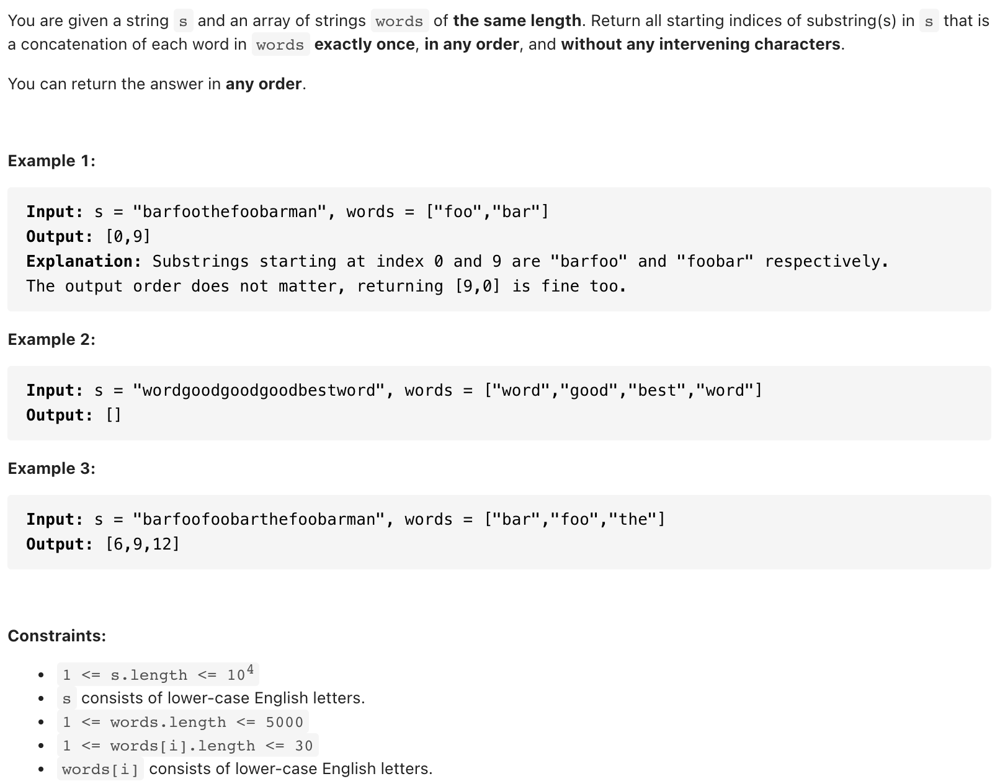

# [30. Substring with Concatenation of All Words (hard)](https://leetcode-cn.com/problems/substring-with-concatenation-of-all-words/)
## 题目：



<br>
<br>

--------------------------------
## 理解：
1. 利用字典存储words中每个单词及其出现次数；
2. 由于每个单词长度(w_l)一样，个数为m，则采用宽度为 m * w_l 的滑动窗口；
3. 每次只需判断滑动窗口中单词(每w_l长度的字符串算作一个单词)的出现次数是否与words中的一样


<br>
<br>


--------------------------------
## Code

```python
class Solution:
    def findSubstring(self, s: str, words: List[str]) -> List[int]:
        """
        利用字典存储words中每个单词及其出现次数
        由于每个单词长度(w_l)一样，个数为m，则采用宽度为 m * w_l 的滑动窗口
        每次只需判断滑动窗口中单词(每w_l长度的字符串算作一个单词)的出现次数是否与words中的一样
        """
        n = len(s)
        m = len(words)
        w_l = len(words[0])
        window_size = m * w_l
        cnt = {word:0 for word in words}
        words_cnt = cnt.copy()
        for word in words:
            words_cnt[word] += 1

        start = 0
        ans = []

        while start < n - window_size + 1:
            temp = cnt.copy()
            for i in range(start, start + window_size, w_l):
                part = s[i: i + w_l]
                if part not in temp:
                    break
                else:
                    temp[part] += 1
                    if temp[part] > words_cnt[part]:
                        break
            else: 
                ans.append(start)
            
            start += 1
        
        return(ans)
```
- Time Complexity: O((n-m)m) s长度为n，len(words)* len(words[0]) 为 m
- Space Complexity: O(m)

<br>
<br>

--------------------------------
## 扩展