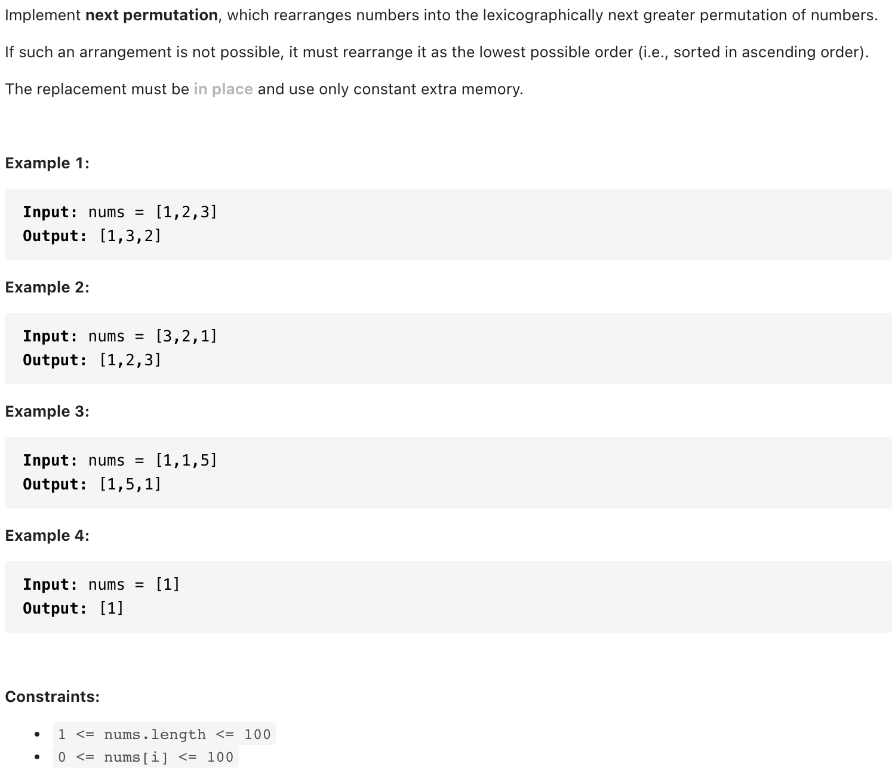
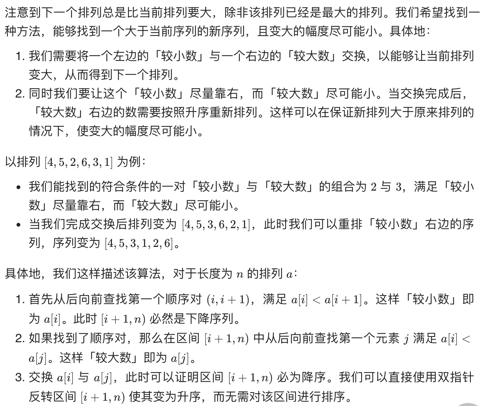
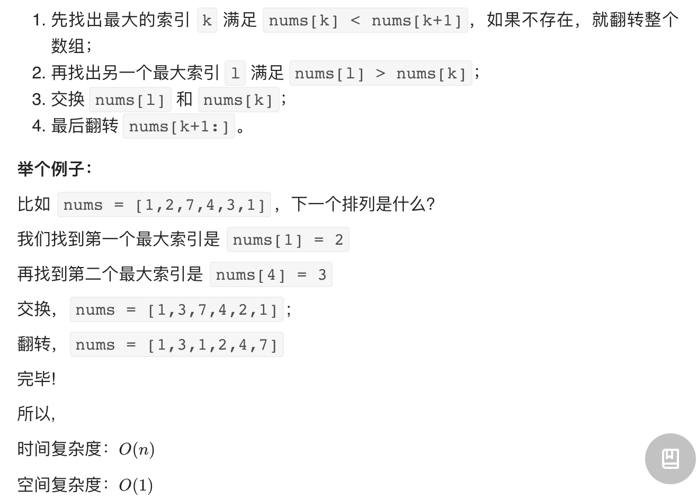

# [ 31. Next Permutation(medium)](https://leetcode-cn.com/problems/next-permutation/)
## 题目：


* Constraints:
<br>
<br>

--------------------------------
## 理解：
1. 


<br>
<br>

2. 


--------------------------------
## Code

```python
class Solution:
    def nextPermutation(self, nums: List[int]) -> None:
        i = len(nums) - 2
        while i >= 0 and nums[i] >= nums[i + 1]:
            i -= 1
        if i >= 0:
            j = len(nums) - 1
            while j >= 0 and nums[i] >= nums[j]:
                j -= 1
            nums[i], nums[j] = nums[j], nums[i]
        
        left, right = i + 1, len(nums) - 1
        while left < right:
            nums[left], nums[right] = nums[right], nums[left]
            left += 1
            right -= 1


```
- Time Complexity: O(N)
- Space Complexity: O(1)
<br>
<br>
```python
class Solution:
    def nextPermutation(self, nums: List[int]) -> None:
        """
        Do not return anything, modify nums in-place instead.
        """
        firstIndex = -1
        n = len(nums)
        def reverse(nums, i, j):
            while i < j:
                nums[i],nums[j] = nums[j], nums[i]
                i += 1
                j -= 1
        for i in range(n-2, -1, -1):
            if nums[i] < nums[i+1]:
                firstIndex = i
                break
        #print(firstIndex)
        if firstIndex == -1:
            reverse(nums, 0, n-1)
            return 
        secondIndex = -1
        for i in range(n-1, firstIndex, -1):
            if nums[i] > nums[firstIndex]:
                secondIndex = i
                break
        nums[firstIndex],nums[secondIndex] = nums[secondIndex], nums[firstIndex]
        reverse(nums, firstIndex+1, n-1)

```
- Time Complexity: O(N)
- Space Complexity: O(1)

  
--------------------------------
## 扩展