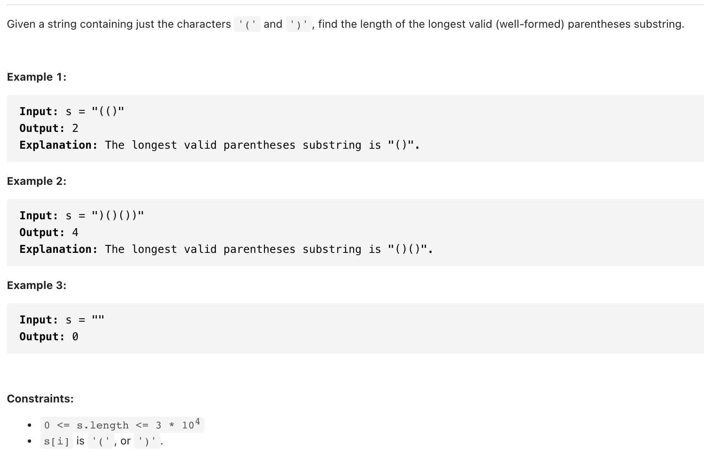

# [32. Longest Valid Parentheses(hard)](https://leetcode-cn.com/problems/longest-valid-parentheses/)
## 题目：


* Constraints:
<br>
<br>

--------------------------------
## 理解：
1. 动态规划

<br>
<br>
2. 栈

--------------------------------
## Code


```python
class Solution:
    def longestValidParentheses(self, s: str) -> int:
        l=len(s)
        if not s:
            return 0
        
        dp=[0]*l
        for i in range(1,l):
            #当遇到右括号时，尝试向前匹配左括号
            if s[i]==")":
                pre=i-dp[i-1]-1
                #如果是左括号，则更新匹配长度
                if pre>=0 and s[pre]=='(':
                    dp[i]=dp[i-1]+2
                    #处理独立的括号对的情形 类似()()、()(())
                    if pre>0:
                        dp[i]+=dp[pre-1]
        return max(dp)

```
- Time Complexity: 
- Space Complexity: 
<br>
<br>

```python
class Solution:

    def longestValidParentheses(self, s):

        st, b = [], [0]*len(s)
        for i, val in enumerate(s):
            if val == '(':
                st.append(i)
            elif st:
                b[st.pop()], b[i] = 1, 1

        c, mc = 0, 0
        for i in b:
            if i:
                c += 1
            else:
                mc = max(c, mc)
                c = 0

        return max(c, mc)

```
- Time Complexity: 
- Space Complexity: 
  
--------------------------------
## 扩展