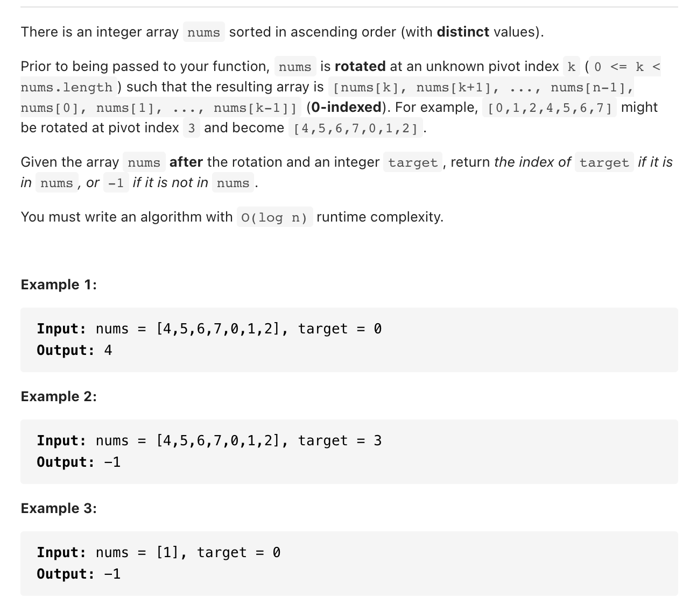

# [ 33. Search in Rotated Sorted Array(mediem)](https://leetcode-cn.com/problems/search-in-rotated-sorted-array/)
## 题目：


* Constraints:
<br>
<br>

--------------------------------
## 理解：
就是返回target值的下标。。。

<br>
<br>


--------------------------------
## Code


```python
class Solution:
    def search(self, nums: List[int], target: int) -> int:
        
        if target in nums:
            return nums.index(target)
        else:
            return -1
```
- Time Complexity: 
- Space Complexity: 
<br>
<br>

```python


```
- Time Complexity: 
- Space Complexity: 
  
--------------------------------
## 扩展