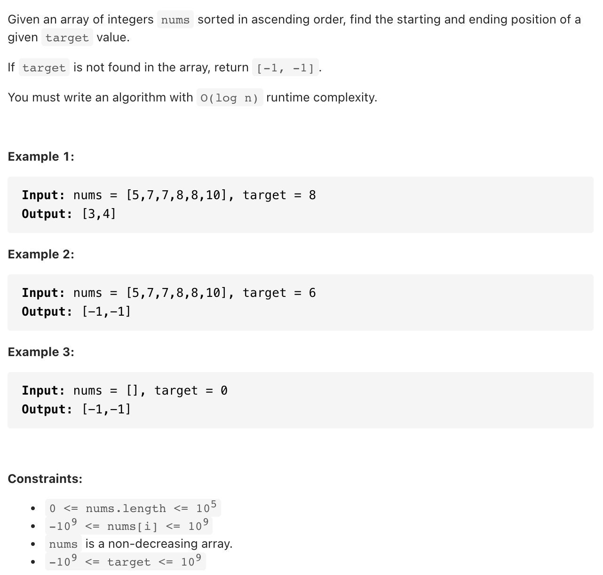
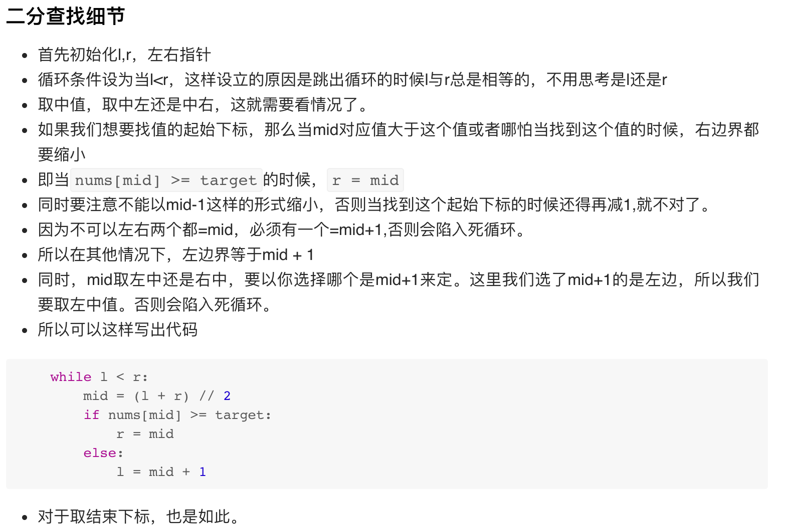

# [34. Find First and Last Position of Element in Sorted Array (medium)]()
## 题目：


* Constraints:
<br>
<br>

--------------------------------
## 理解：


<br>
<br>


--------------------------------
## Code


```python
class Solution:
    def searchRange(self, nums: List[int], target: int) -> List[int]:
        # 取起始下标
        l, r = 0, len(nums) - 1
        while l < r:
            mid = (l + r) // 2
            if nums[mid] >= target:
                r = mid
            else:
                l = mid + 1

        # 没找到
        if not nums or nums[l] != target:
            return [-1,-1]
        
        # 取结束下标
        a, b = l, len(nums) - 1
        while a < b:
            mid = (a + b + 1) // 2
            if nums[mid] <= target:
                a = mid
            else:
                b = mid - 1
        
        return [l,a]

```
- Time Complexity: O(log(n))
- Space Complexity: 
<br>
<br>

```python


```
- Time Complexity: 
- Space Complexity: 
  
--------------------------------
## 扩展