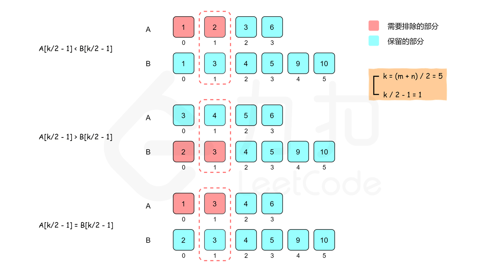

# [4. Median of Two Sorted Arrays(hard)](https://leetcode-cn.com/problems/median-of-two-sorted-arrays/)

## 题目：
Given two sorted arrays nums1 and nums2 of size m and n respectively, return the median of the two sorted arrays.

The overall run time complexity should be **O(log (m+n))**.

* 示例:
    - Input: nums1 = [1,3], nums2 = [2]
    - Output: 2.00000
    - Explanation: merged array = [1,2,3] and median is 2.

<br>

--------------------------------

## 理解：
+ 一共四种解法，但是只有二分法才能达到time complexity的要求
1. 暴力解法：将两数组合并后排序，然后根据奇数或偶数返回中位数
2. 二分法：只需要找到median的位置即可，两个pointer，初始时分别指向两个数组下标为0的位置，每次将指向较小值的pointer后移一位（如果一个pointer已经达到数组的末尾，则只需要移动另一个数组的pointer）直到达到median的位置。  
    - 当m+n是奇数时，中位数是(m+n)/2位数
      - 将中位数分到左边数组
    - 当m+n是偶数时，中位数是((m+n)/2 + ((m+n)/2+1))/2 :` 中位数有两个`
      - 一个是左边数组的最大值，和右边数组的最小值
  <br> 
  <br> 
        
    - 思路：
        - 假设有两个有序数组A,B,要找到第k个数
        - 比较**A[k/2−1]** 和 **B[k/2−1]**，其中 / 表示整数除法<br>
            1. A[k/2−1] < B[k/2−1]: 比 A[k/2−1] 小的数最多只有 `A 的前 k/2−1 个数和 B 的前 k/2−1 个数`,即比 A[k/2−1] 小的数最多只有 k−2 个，因此A[k/2−1] 不可能是第 k 个数，A[0] 到 A[k/2−1] 也都不可能是第 k 个数，可以全部排除。
            2. A[k/2−1] > B[k/2−1]: 排除 B[0] 到 B[k/2−1]
            3. A[k/2−1] = B[k/2−1]: 纳入第一种情况

            可以排除k/2个不是第k小的数，范围缩小一半，根据排除数字的个数减小
            - 需要特殊处理的三种情ß况：
                1. 如果A[k/2−1] 或 B[k/2−1]越界，可以选取对应数组的最后一个数，根据排除数字的个数减小k（不能直接将k-(k/2)).
                2. 如果一个数组为空，这直接返回另一个数组中第k个元素
                3. 如果k=1，只要返回两个数组首元素的最小值
<br>
- 简化思路：
  - 两个数组用一条分割线分割成两部分：
    - 分割线左右元素个数相等，或者左边比右边多一个数 size_left=size_right+1
    - 左边所有元素的数值<=右边所有元素的数值
  - 中位数一定只与分割线两侧的元素有关
  - 两个数组元素个数和：
    - 奇数：比较分割线左边两个元素，大的为中位数
    - 偶数：分割线左边的最大值+右边最小值/2=中位数


<br>

--------------------------------
## Code

``` python
class Solution:
    def findMedianSortedArrays(self, nums1: List[int], nums2: List[int]) -> float:
        def getKthElement(k):
            ''' 
            - 主要思路：要找到第 k (k>1) 小的元素，那么就取 pivot1 = nums1[k/2-1] 和 pivot2 = nums2[k/2-1] 进行比较
            - 这里的 "/" 表示整除
            - nums1 中小于等于 pivot1 的元素有 nums1[0 .. k/2-2] 共计 k/2-1 个
            - nums2 中小于等于 pivot2 的元素有 nums2[0 .. k/2-2] 共计 k/2-1 个
            - 取 pivot = min(pivot1, pivot2)，两个数组中小于等于 pivot 的元素共计不会超过 (k/2-1) + (k/2-1) <= k-2 个
            - 这样 pivot 本身最大也只能是第 k-1 小的元素
            - 如果 pivot = pivot1，那么 nums1[0 .. k/2-1] 都不可能是第 k 小的元素。把这些元素全部 "删除"，剩下的作为新的 nums1 数组
            - 如果 pivot = pivot2，那么 nums2[0 .. k/2-1] 都不可能是第 k 小的元素。把这些元素全部 "删除"，剩下的作为新的 nums2 数组
            - 由于我们 "删除" 了一些元素（这些元素都比第 k 小的元素要小），因此需要修改 k 的值，减去删除的数的个数
            '''
            index1, index2 = 0, 0
            while True:
                # 特殊情况
                if index1 == m:
                    return nums2[index2 + k - 1]
                if index2 == n:
                    return nums1[index1 + k - 1]
                if k == 1:
                    return min(nums1[index1], nums2[index2])

                # 正常情况
                newIndex1 = min(index1 + k // 2 - 1, m - 1)
                newIndex2 = min(index2 + k // 2 - 1, n - 1)
                pivot1, pivot2 = nums1[newIndex1], nums2[newIndex2]
                if pivot1 <= pivot2:
                    k -= newIndex1 - index1 + 1
                    index1 = newIndex1 + 1
                else:
                    k -= newIndex2 - index2 + 1
                    index2 = newIndex2 + 1
        
        m, n = len(nums1), len(nums2)
        totalLength = m + n
        if totalLength % 2 == 1:
            return getKthElement((totalLength + 1) // 2)
        else:
            return (getKthElement(totalLength // 2) + getKthElement(totalLength // 2 + 1)) / 2
```
- Time Complexity: O(log(m+n))，其中 mm 和 nn 分别是数组nums 1和 nums2 的长度。
  - 初始时有 k=(m+n)/2 或 k=(m+n)/2+1，每一轮循环可以将查找范围减少一半，
  - 因此时间复杂度是 O(log(m+n))。

- Space Complexity: O(1)

<br>

--------------------------------
## 扩展