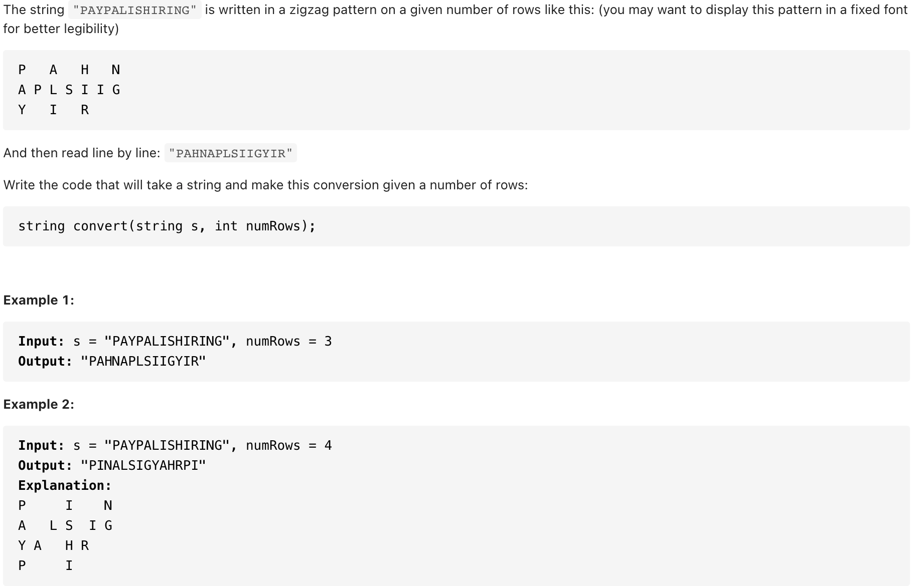

# [6. ZigZag Conversion（medium](https://leetcode-cn.com/problems/zigzag-conversion/)
## 题目：
 
 


- Constraints:
  - 1 <= s.length <= 1000
  - s consists of English letters (lower-case and upper-case), ',' and '.'
  - 1 <= numRows <= 1000


<br>
--------------------------------
## 理解：
1. 按照写N的过程，遍历每个字符，然后将字符存入对应行中，用down保存当前的遍历方向，如果遍历到两端就改变方向
    - 按顺序遍历字符串s
      - res[i] += c :把每个字符c填入对应行si
      - i += flag 更新当前字符c的对应索引行
      - flag = -flag ：到达N转折点时，反向执行
<br>

<br>

--------------------------------
## Code

```python
class Solution:
    def convert(self, s:str, numRows:int)->str:
        if numRows < 2:
            return s
        res=["" for _ in range(numRows)]
        i, flag=0, -1
        for c in s:
            res[i]+=c
            if i==0 or i==numRows-1:
                flag=-flag
            i+=flag
        return "".join(res)
```
- Time Complexity: 
- Space Complexity: 

<br>

--------------------------------
## 扩展