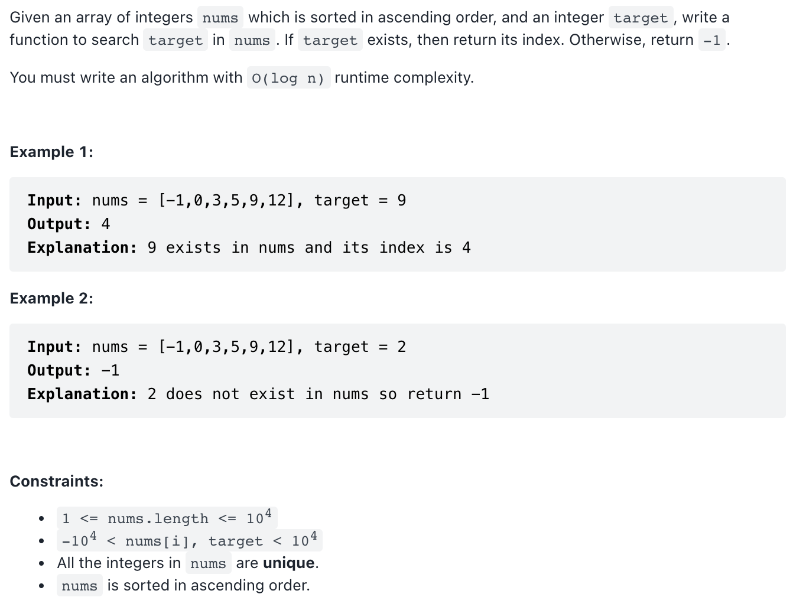

# [704. Binary Search (easy)](https://leetcode-cn.com/problems/binary-search/)
## 题目：



<br>
<br>

--------------------------------
## 理解：
太容易。跳过

<br>
<br>


--------------------------------
## Code


```python
class Solution:
    def search(self, nums: List[int], target: int) -> int:
        if target not in nums:
            return -1
        else: 
            return nums.index(target)

```
- Time Complexity: 
- Space Complexity: 
<br>
<br>

```python


```
- Time Complexity: 
- Space Complexity: 
  
--------------------------------
## 扩展