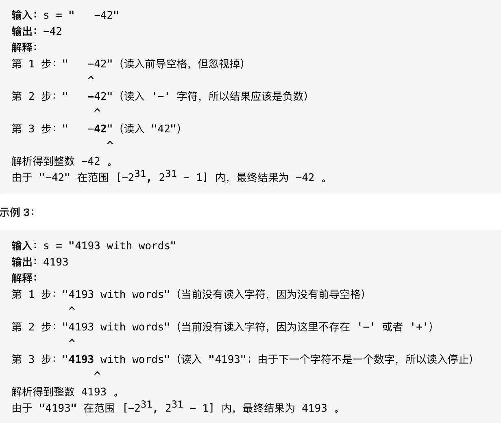

# [8. String to Integer (atoi) (medium)](https://leetcode-cn.com/problems/string-to-integer-atoi/)
## 题目：
Implement the myAtoi(string s) function, which converts a string to a 32-bit signed integer (similar to C/C++'s atoi function).

The algorithm for myAtoi(string s) is as follows:

1. Read in and ignore any leading whitespace.
2. Check if the next character (if not already at the end of the string) is '-' or '+'. Read this character in if it is either. This determines if the final result is negative or positive respectively. Assume the result is positive if neither is present.
3. Read in next the characters until the next non-digit charcter or the end of the input is reached. The rest of the string is ignored.
4. Convert these digits into an integer (i.e. "123" -> 123, "0032" -> 32). If no digits were read, then the integer is 0. Change the sign as necessary (from step 2).
5. If the integer is out of the 32-bit signed integer range [-231, 231 - 1], then clamp the integer so that it remains in the range. Specifically, integers less than -231 should be clamped to -231, and integers greater than 231 - 1 should be clamped to 231 - 1.
6. Return the integer as the final result.
- Note:
  - Only the space character ' ' is considered a whitespace character.
  - Do not ignore any characters other than the leading whitespace or the rest of the string after the digits.

* 示例:
  <br>

<br>
<br>
* Constraints:
  * 0 <= s.length <= 200
  * s 由英文字母（大写和小写）、数字（0-9）、' '、'+'、'-' 和 '.' 组成
<br>
--------------------------------
## 理解：
用python自带函数能很快写出来
<br>

<br>

--------------------------------
## Code
1. python自带
```python
class Solution:
    def myAtoi(self, s: str) -> int:
        INT_MAX = 2147483647    
        INT_MIN = -2147483648
        s = s.lstrip()                         #清除左边多余的空格
        num_re = re.compile(r'^[\+\-]?\d+')    #设置正则规则
        num = num_re.findall(s)                #查找匹配的内容
        num = int(*num)                        #由于返回的是个列表，用*对列表解包得到字符串并且转换成整数
        return max(min(num,INT_MAX),INT_MIN)   #返回值
    
    #一行模式
    return max(min(int(*re.findall('^[\+\-]?\d+', s.lstrip())), 2**31 - 1), -2**31)
    
    # re.findall('^[\+\-]?\d+', s.lstrip()) ^表示在行的开头匹配，保证以+-0-9开头；后续只能是连续数字。
    # re.findall() 没有匹配时返回[],否则返回全部符合该正则的子字符串；在这里因为输入只有一行，所以结果只能是空列表或者长度为1的列表
    # * 用来解包，也就是把列表展开。
    # int() 在输入为空的情况下，会返回0。（也就是说能够处理空列表展开的情况）
```
- Time Complexity: 
- Space Complexity: 

<br>

--------------------------------
## 扩展
### 正则表达式
- `r'^[\+\-]?\d+'`

  - ^ 表示匹配字符串开头，我们匹配的就是 '+'  '-'  号

  - [] 表示匹配包含的任一字符，比如[0-9]就是匹配数字字符 0 - 9 中的一个

  - ? 表示前面一个字符出现零次或者一次，这里用 ? 是因为 '+' 号可以省略

  -   \d 表示一个数字 0 - 9 范围

  - \+ 表示前面一个字符出现一次或者多次，\\d+ 合一起就能匹配一连串数字了